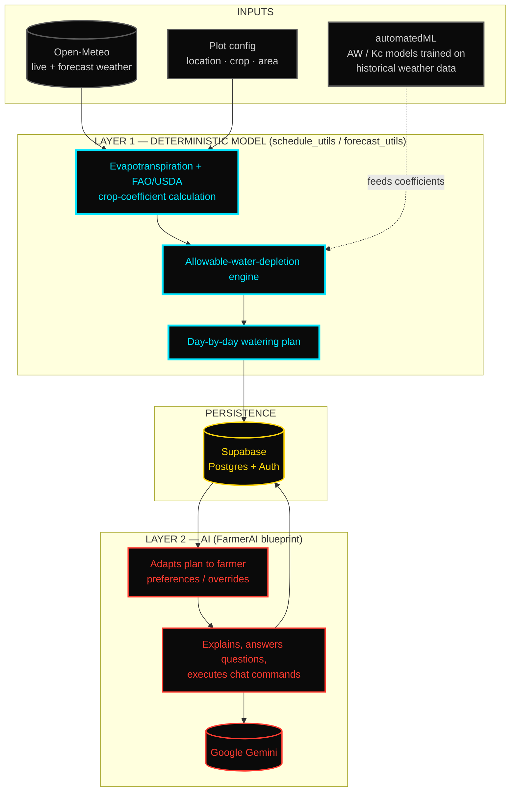

# Miraqua

Miraqua turns weather data and crop parameters into precise, automated
watering schedules. No guesswork, no overwatering, no dead plants.

The schedule is **not** an AI guess. Give it a plot's location, crop, and
area, and a deterministic agronomic model — FAO/USDA crop coefficients run
against live weather and evapotranspiration data — computes the exact
water demand and outputs a day-by-day plan. Every run on the same inputs
produces the same plan. AI only enters after that: `FarmerAI` sits on top
as an adaptive layer that folds in farmer preferences, answers questions,
and explains why the model did what it did — it personalizes and narrates
the plan, it does not replace the math.

## Repository layout

Several builds of the product live here, at different stages:

| Path | Description |
|---|---|
| `MiraquaOfficial/` | Main app: React Native (Expo) frontend + Flask backend, Supabase for data/auth, Gemini-powered `FarmerAI` chat assistant |
| `MiraquaAppExpo/` | Earlier standalone Expo/React Native client |
| `MiraquaWebsite/` | Marketing site + a standalone Flask irrigation optimizer (`optimizer_backend.py`) deployed via Netlify |
| `MiraquaLoveable/` | Web prototype generated with Lovable |
| `automatedML/` | Scripts for predicting allowable water depletion (AW) from historical weather data (`aw_predictor.py`, `daily_aw_predictor.py`, `unified_aw_model.py`) |
| `farmerAI/` | Standalone version of the AI watering assistant module |

`MiraquaOfficial/` is the live build. Everything else is a prior
prototype, kept for reference.

## Architecture

Model first, AI last. Every layer below only runs after the one above it
has already produced a hard, reproducible answer.



**Why it's built this way:** the watering plan has to be trustworthy and
auditable — a fixed model computing exact water demand from weather and
crop-stage data means the same inputs always yield the same plan, and a
farmer can check the math. AI is layered on afterward, strictly for
personalization (folding in preferences and overrides) and interface
(chat, explanations, one-off commands like "skip tomorrow"). It never
touches the core calculation.

**Request flow:**
1. Expo app requests a plan (`/get_plan`) with a plot's location, crop, and area.
2. **Layer 1** pulls live/forecast weather from Open-Meteo (`forecast_utils`), runs it through FAO/USDA crop coefficients and the allowable-water-depletion engine (`schedule_utils`) — using AW/Kc models pretrained offline in `automatedML/` — and produces the deterministic day-by-day plan.
3. The plan is persisted to **Supabase**.
4. **Layer 2** only engages on demand: the `FarmerAI` blueprint reads the stored plan from Supabase, adapts it to farmer preferences/overrides, and calls **Gemini** to answer questions or explain decisions in plain language (`/chat`, `/get_chat_log`).

## Tech stack

- **Frontend:** React Native + Expo, React Navigation, `react-native-maps`, Google Places Autocomplete
- **Backend:** Flask, Supabase (Postgres + auth), Open-Meteo weather API, Google Generative AI (Gemini)
- **ML/data:** pandas, numpy, crop/water depletion models trained on historical weather + irrigation data
- **Hosting:** Netlify (website), Supabase (database)

## Getting started

The live app is in `MiraquaOfficial/`.

### Backend

```bash
cd MiraquaOfficial/backend
pip install -r requirements.txt
# create a .env with your Supabase, weather, and Gemini API keys
python start_backend.py
```

### Frontend

```bash
cd MiraquaOfficial
npm install
npm start          # expo start
```

Or both at once:

```bash
cd MiraquaOfficial
npm run dev
```

Full API docs and env var details: `MiraquaOfficial/BACKEND_SETUP.md` and `MiraquaOfficial/backend/README.md`.

## Core features

- Deterministic, weather-aware watering schedules per plot — same inputs, same plan
- AI layer that adapts the plan to farmer preferences and explains it in plain language
- Manual override (`water now`) and schedule revert
- Multi-plot management with per-plot crop and area settings
