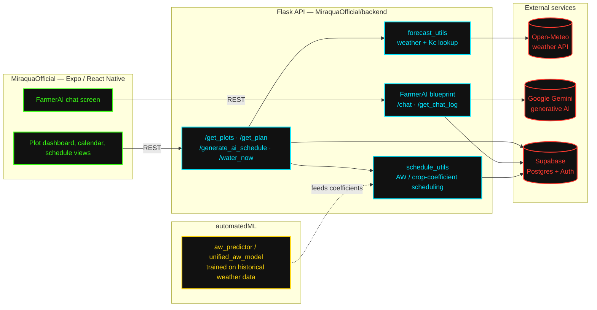

# Miraqua

Miraqua turns weather data and crop parameters into precise, automated
watering schedules. No guesswork, no overwatering, no dead plants.

Give it a plot's location, crop, and area. It pulls live weather and
forecast data, runs an allowable-water-depletion model against
FAO-style crop coefficients, and outputs a day-by-day watering plan.
`FarmerAI` explains the plan and answers questions about it directly.

## Repository layout

Several builds of the product live here, at different stages:

| Path | Description |
|---|---|
| `MiraquaOfficial/` | Main app: React Native (Expo) frontend + Flask backend, Supabase for data/auth, Gemini-powered `FarmerAI` chat assistant |
| `MiraquaAppExpo/` | Earlier standalone Expo/React Native client |
| `MiraquaWebsite/` | Marketing site + a standalone Flask irrigation optimizer (`optimizer_backend.py`) deployed via Netlify |
| `MiraquaLoveable/` | Web prototype generated with Lovable |
| `automatedML/` | Scripts for predicting allowable water depletion (AW) from historical weather data (`aw_predictor.py`, `daily_aw_predictor.py`, `unified_aw_model.py`) |
| `farmerAI/` | Standalone version of the AI watering assistant module |

`MiraquaOfficial/` is the live build. Everything else is a prior
prototype, kept for reference.

## Architecture



**Request flow:**
1. Expo app hits `/get_plan` for a schedule, or `/chat` for FarmerAI.
2. Backend pulls live/forecast weather from **Open-Meteo**, combines it with crop coefficients (`forecast_utils`).
3. `schedule_utils` computes AW-based watering days, using coefficients from models trained offline in `automatedML/`.
4. Plots, schedules, and chat history persist in **Supabase**.
5. For chat, the `FarmerAI` blueprint calls **Gemini** with the plot's schedule and context, returns a plain-language answer.

## Tech stack

- **Frontend:** React Native + Expo, React Navigation, `react-native-maps`, Google Places Autocomplete
- **Backend:** Flask, Supabase (Postgres + auth), Open-Meteo weather API, Google Generative AI (Gemini)
- **ML/data:** pandas, numpy, crop/water depletion models trained on historical weather + irrigation data
- **Hosting:** Netlify (website), Supabase (database)

## Getting started

The live app is in `MiraquaOfficial/`.

### Backend

```bash
cd MiraquaOfficial/backend
pip install -r requirements.txt
# create a .env with your Supabase, weather, and Gemini API keys
python start_backend.py
```

### Frontend

```bash
cd MiraquaOfficial
npm install
npm start          # expo start
```

Or both at once:

```bash
cd MiraquaOfficial
npm run dev
```

Full API docs and env var details: `MiraquaOfficial/BACKEND_SETUP.md` and `MiraquaOfficial/backend/README.md`.

## Core features

- AI-generated, weather-aware watering schedules per plot
- Manual override (`water now`) and schedule revert
- Conversational assistant for irrigation questions
- Multi-plot management with per-plot crop and area settings
