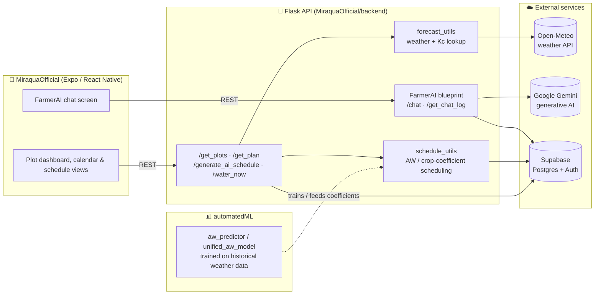

# Miraqua

Miraqua is a smart irrigation platform that turns weather data, soil/crop
parameters, and AI-driven scheduling into precise watering plans for gardens
and farms — cutting water waste while keeping plants healthy.

Given a plot's location, crop type, and area, Miraqua pulls real-time and
forecast weather data, models crop water demand (FAO-style crop
coefficients / allowable water depletion), and produces a day-by-day
watering schedule. An AI assistant ("FarmerAI") explains the schedule and
answers questions about it in plain language.

## Repository layout

This repo hosts several iterations/clients of the product built at
different stages:

| Path | Description |
|---|---|
| `MiraquaOfficial/` | Main app: React Native (Expo) frontend + Flask backend, Supabase for data/auth, Gemini-powered `FarmerAI` chat assistant |
| `MiraquaAppExpo/` | Earlier standalone Expo/React Native client |
| `MiraquaWebsite/` | Marketing site + a standalone Flask irrigation optimizer (`optimizer_backend.py`) deployed via Netlify |
| `MiraquaLoveable/` | Web prototype generated with Lovable |
| `automatedML/` | Scripts for predicting allowable water depletion (AW) from historical weather data (`aw_predictor.py`, `daily_aw_predictor.py`, `unified_aw_model.py`) |
| `farmerAI/` | Standalone version of the AI watering assistant module |

`MiraquaOfficial/` is the actively developed app; the rest are prior
prototypes/experiments kept for reference.

## Architecture



**Request flow, end to end:**
1. The Expo app requests a plot's schedule (`/get_plan`) or asks FarmerAI a question (`/chat`).
2. The Flask backend pulls live/forecast weather from **Open-Meteo** and combines it with crop coefficients (`forecast_utils`).
3. `schedule_utils` computes allowable-water-depletion-based watering days, informed by models trained offline in `automatedML/`.
4. Plots, schedules, and chat history are persisted in **Supabase** (Postgres).
5. For conversational queries, the `FarmerAI` blueprint calls **Gemini** with the plot's schedule/context and returns a plain-language answer.

## Tech stack

- **Frontend:** React Native + Expo, React Navigation, `react-native-maps`,
  Google Places Autocomplete
- **Backend:** Flask, Supabase (Postgres + auth), Open-Meteo weather API,
  Google Generative AI (Gemini) for the chat assistant
- **ML/data:** pandas, numpy, scikit-learn-style crop/water models trained
  on historical weather + irrigation data
- **Hosting:** Netlify (website), Supabase (database)

## Getting started

The main app lives in `MiraquaOfficial/`.

### Backend

```bash
cd MiraquaOfficial/backend
pip install -r requirements.txt
# create a .env with your Supabase, weather, and Gemini API keys
python start_backend.py
```

### Frontend

```bash
cd MiraquaOfficial
npm install
npm start          # expo start
```

Or run both together:

```bash
cd MiraquaOfficial
npm run dev
```

See `MiraquaOfficial/BACKEND_SETUP.md` and `MiraquaOfficial/backend/README.md`
for full API documentation and environment variable details.

## Core features

- AI-generated, weather-aware watering schedules per plot
- Manual override ("water now") and schedule revert
- Conversational assistant for irrigation questions
- Multi-plot management with per-plot crop and area settings
